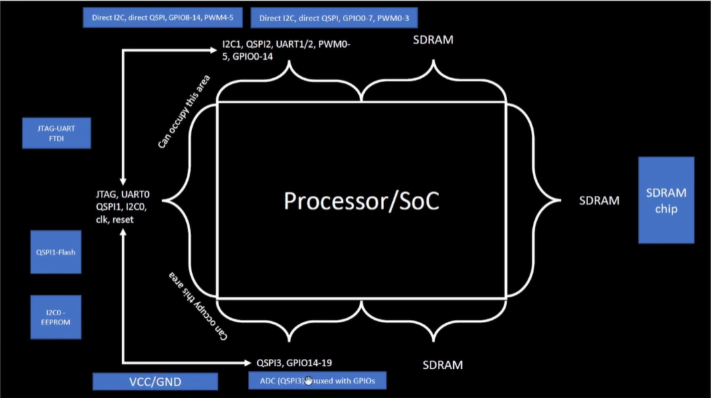

## Day 1 -  Inception of open-source EDA, OpenLANE and Sky130 PDK
## Author : Goutham Badhrinath V

### <h1 id="header-1_1">Introduction to Chip Design</h1>

#### Chip Components 
(1) **Pads:** Through which we can send the signal inside the chip.

(2) **Core:** Place where all the logic gates are fixed.

(3) **Die:** Present at the corner. it is the size of the entire chip.

**RISC-V SoC**:- It consist of SRAM,SOC,ADC,DAC,SPI these all are called foundary IP's.All devices depends upon foundary where all chips are fabricated using deposition and lithography techniques and so on.




### <h1 id="header-1_1_2">Introduction to RISC-V</h1>
RISC-V is an open standard instruction set architecture (ISA) based on RISC principles, where "five" refers to the fifth generation of RISC architecture developed at UC Berkeley. Unlike other ISAs, RISC-V is provided under open source licenses with no usage fees. It features a fixed 32-bit instruction length with variable-length extensions and supports 32-bit and 64-bit address space variants. The specification is widely supported in hardware and software toolchains.

Chips are connected to packages using bond wires.


### <h1 id="header-1_1_2">From Software Applications to Hardware</h1>
**Software to Hardware Flow**

Applications run through multiple layers of system software before executing on hardware:

1. **Operating System** - Manages I/O operations and memory allocation
2. **Compiler** - Converts high-level languages (C, C++, Java) into hardware-specific instructions
3. **Assembler** - Translates instructions into binary language

**Instructions** serve as the abstract interface between the C-language program and the hardware, allowing the hardware to execute functions and produce output based on the received binary commands.


 ## <h1 id="header-1_2">Soc design and OpenLANE</h1>
To design Digital ASIC, a few essential tools are required from day one. These include:

**RTL Design, EDA Tools, PDK Data**

**What is RTL Design?**  
In digital circuit design, register-transfer level (RTL) is a design abstraction that models a synchronous digital circuit in terms of the flow of digital signals (data) between hardware registers and the logical operations performed on those signals. Many open-source resources are available for RTL design, such as librecores.org, opencores.org, and github.com.

**What are EDA Tools?**  
Electronic Design Automation (EDA) refers to the tools used to design and verify integrated circuits (ICs), printed circuit boards (PCBs), and electronic systems in general. Numerous open-source tools are available, including Qflow, OpenROAD, and OpenLANE.

**What is PDK Data?**  
PDK stands for Process Design Kit. It serves as the interface between fabrication (FAB) and design. This data consists of collections of files, including:

- Process design rules: DRC, LVS, REX
- Digital standard cell libraries
- I/O libraries

These files are used to model a fabrication process for the EDA tools employed in IC design. For instance, in 2020, Google released an open-source PDK for FOSS 130nm production using SkyWater technology. Currently, advancements are also being made in the 5nm process. However, for many applications, advanced nodes are not necessary, and the cost of advanced nodes is significantly higher than that of 130nm processors. Notably, 130nm processors can still be fast; for example:

- Intel: P4EE @3.46 GHz (Q4'04)
- Sky130_OSU (single-cycle RV32i CPU) pipeline version can achieve more than 1 GHz clock.

### <h1 id="header-1_2_2"> Simplified RTL2GDS flow</h1>


**Step 1. Synthesis:** The design RTL is translated to a circuit from the SCL, resulting in a gate level netlist that is functionally equivalent to the RTL. "Standard Cells" have regular layouts like Electrical, HDL, and SPICE.

**Step 2. Floor/Power Planning:** The objective is to plan the silicon area and distribute power across the circuit. Chip floor planning partitions the die between system blocks and places I/O pads, while micro floor planning defines dimensions and pin locations. Power planning constructs the power network using multiple VDD and GND connections, employing parallel structures to reduce resistance and utilizing upper metal layers to address electromagnetization.

**Step 3. Placement:** The gate level netlist is placed on the floor planning rows, minimizing interconnect delay. Placement occurs in two steps:
- **Global Placement:** Cells are roughly placed within the core area, focusing on timing and congestion.
- **Detailed Placement:** Exact routes and layers for each netlist are determined, aiming for valid routing, minimized area, and timing constraints.

**Step 4. Clock Tree Synthesis:** The clock is routed to every sequential element, forming a tree structure. The synthesis minimizes skew using low-skew global routing resources.

**Step 5. Routing:** After clock routing, signal routing connects pins using metal layers. Routing is divided into:
- **Global Routing:** Generates routing guides.
- **Detailed Routing:** Implements actual wiring based on guides.

**Step 6. Sign Off:** The final layout undergoes verification, including:
- **Physical Verification:** Design rule checking of the final layout.
- **Timing Verification:** Static Timing Analysis is performed.


### <h1 id="header-1_2_3">Whats OpenLANE?</h1>

OPENLANE is an automated RTL to GDSII flow that is composed of several tools such as OpenROAD, Yosys, Magic, Netgen, Fault, CVC SPEF-Extractor, CU-GR, Klayout and a number of scripts used for design exploration and optimization. It is started as an Open-source flow for a true Open Source tape-out Experiment. striVe is a family of open everything SoCs:
Open PDK, Open EDA, Open RTL

The main goal of OPENLANE is to produce a clean GDSII with no human intervation (no-human-in-the-loop). here the meaning of clean is that:

No LVS violations +
No DRC Violations + 
No timing Violations

OPENLANE is tuned for skyWter130nm open PDK. it can be used to harden Macros and chips.there is two mode of operation
interactive : here we can run comamds and steps one by one.

### <h1 id="header-1_2_4">OpenLANE detailed ASIC design flow</h1>


The design exploration utility is utilized for regression testing (CI), running OpenLANE on approximately 70 designs and comparing results to the best-known ones.

**DFT (Design for Test)**  
It performs scan insertion, automatic test pattern generation, test pattern compaction, fault coverage, and fault simulation. Following this, physical implementation is conducted by the OpenROAD app, which involves several steps:

- Floor/Power Planning
- End Decoupling Capacitors and Tap Cells Insertion
- Placements: Global and Detailed
- Post Placement Optimization
- Clock Tree Synthesis (CTS)
- Routing: Global and Detailed

Every time the netlist is modified (CTS and post-placement optimization both modify the netlist), verification must be performed. The LCE (Yosys) is used to formally confirm that the function did not change after modifying the netlist.

### Dealing with Antenna Rules Violation  
When a metal wire segment is fabricated, it can act as an antenna, collecting charges that can damage the transistor gates during fabrication. To address this issue, we limit the length of the wire, typically the router's responsibility. If the router fails, two solutions exist:
- Bridging attaches a higher layer intermediary.
- Adding an antenna diode cell to leak away charges (antenna diodes are provided by the SCL).

With OpenLANE, a preventive approach is taken by adding fake antenna diodes next to every cell input after placement. The Antenna checker is then run on the routed layout. If a violation is reported on a cell input pin, the fake diode cell is replaced with a real one.

**Static Timing Analysis (STA)**  
This involves interconnect RC extraction (DEF2SPEF) from the routed layout, followed by STA using the OpenSTA (OpenROAD) tool. The resulting report will indicate any timing violations.

**Physical Verification (DRC and LVS)**  
Magic is used for design rule checking and SPICE extraction from the layout, while Magic and Netgen are used for LVS.

### <h1 id="header-1_3">OpenLANE Directory Structure</h1>

We are working in Sky130_fd_sc_hd PDK variant. where, "sky130" is process name or node name."fd" is a foundary name (skyWater foundary)."sc" means standerd cell librery files and the last one "hd" stands for high density(basically one type of variant).

Sky130_fd_sc_hd varient contains many technology files like verilog, spice, techlef, meglef,mag,gds,cdl,lib,lef,etc. (techlef file contains the layer information).


### <h1 id="header-1_3_1">Design Preparation Step</h1>

To begin the design preparation step, enter the OpenLANE environment using `flow.tcl`. The interactive switch enables step-by-step execution, whereas running without it executes the complete RTL to GDSII flow automatically. Load the required packages and select a design (such as `picorv32a`). The configuration file (`config.tcl`) specifies design parameters including clock period and other settings. Before synthesis, execute `prep -design picorv32a` to initialize the design setup.

```prep -design picorv32a```


### <h1 id="header-1_3_3">Review files after design prep and run synthesis</h1>

After design preparation, a run directory is created with today's date. This directory contains the necessary folders for OpenLANE operations.

The `temp` folder contains the `merged.lef` file, which holds wire, layer, and cell-level information. The `result` folder remains empty until processes are executed, while the `report` folder contains subdirectories for synthesis, placement, floorplanning, CTS, routing, magic, and LVS reports.

A `config.tcl` file in the run directory mirrors the design folder's configuration but includes all default parameters. You can verify modifications by comparing changes (such as core utilization) in this file after running different stages.

To start synthesis, run the command 

```run_synthesis```


After synthesis completes, the result folder populates with mapped data generated by ABC. From the synthesis report, you can extract key metrics such as:
- Total D flip-flops: 1613
- Total cells: 14876
- **Flop Ratio** = (Number of Flip-Flops) / (Total Cells) = **10.84%**


